# System Design Core Concepts - Comprehensive Visual Guide

## Table of Contents
1. [Storage Systems](#1-storage-systems)
2. [Performance Metrics](#2-performance-metrics)
3. [Latency Percentiles](#3-latency-percentiles)
4. [Resource Utilization](#4-resource-utilization)
5. [Concurrency & Little's Law](#5-concurrency--littles-law)
6. [CPU Concepts](#6-cpu-concepts)
7. [Quick Reference Formulas](#7-quick-reference-formulas)
8. [Interview Tips & Patterns](#8-interview-tips--patterns)
9. [Visual Decision Trees](#9-visual-decision-trees)

---

## 1. Storage Systems

### Hot vs Cold Storage Overview

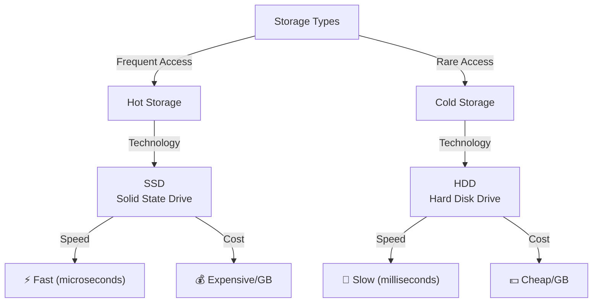

### Detailed Comparison

| Aspect | Hot Storage (SSD) | Cold Storage (HDD) |
|--------|------------------|-------------------|
| **Technology** | Flash memory | Spinning magnetic disk |
| **Access Speed** | ~0.1 ms | ~10 ms |
| **Cost/GB** | $0.10-0.20 | $0.02-0.05 |
| **Throughput** | High (>1000 MB/s) | Medium (100-200 MB/s) |
| **Reliability** | MTBF: 2-3 years | MTBF: 3-5 years |
| **Use Case** | Production, real-time | Archives, backups |

### Use Case Decision Tree

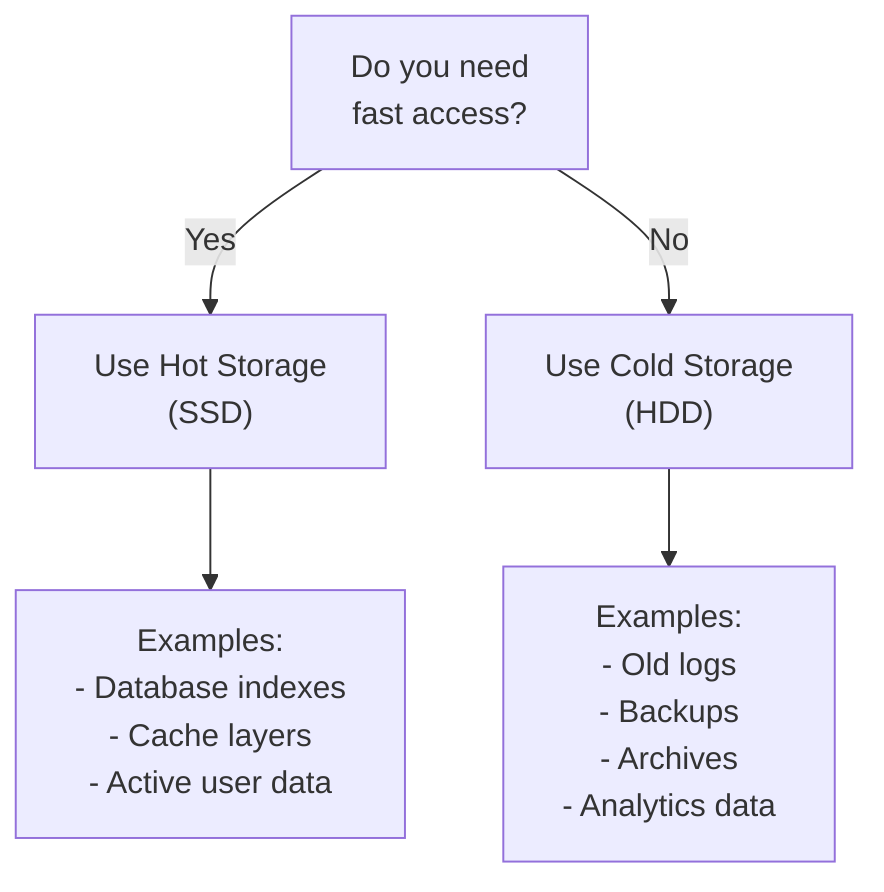

### Real-World Architecture Example

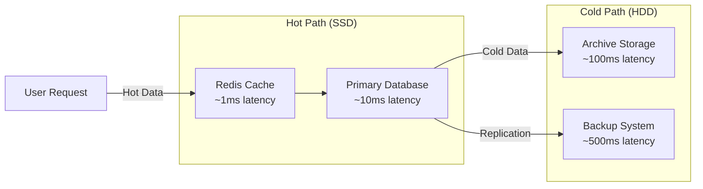

---

## 2. Performance Metrics

### Latency vs Throughput - Core Concepts

#### **Latency**
Time for a **single request** to complete.

```
Latency = End Time - Start Time

Example: HTTP GET request takes 50ms → Latency = 50ms
```

#### **Throughput**
Number of **requests processed per unit time**.

```
Throughput = Number of Requests / Time Period

Example: 10,000 requests/second → Throughput = 10k RPS
```

### Visual Comparison

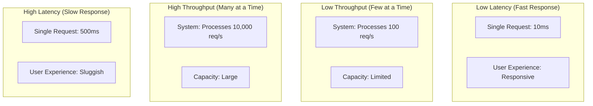

### The Fundamental Trade-off

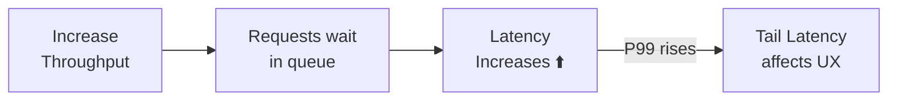

### Batch Processing Trade-off Example

**Sequential Processing (Low Throughput, Low Latency)**
```
Time: 0ms    10ms   20ms   30ms   40ms   50ms
      |------|------|------|------|------|
      Req1   Req2   Req3   Req4   Req5   Req6
      
Latency per request: ~10ms
Throughput: 100 req/s
```

**Batch Processing (High Throughput, High Latency)**
```
Time: 0ms         50ms        100ms       150ms
      |-----------|-----------|-----------|
      [Batch 1: 50 reqs]  [Batch 2: 50 reqs]
      
Latency per request: ~50ms (wait for batch to fill)
Throughput: 500 req/s
```

### Queuing Overhead Impact

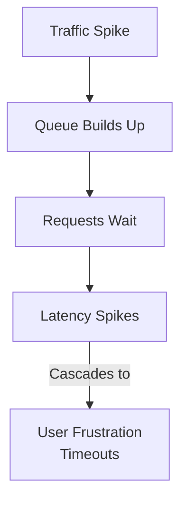

---

## 3. Latency Percentiles

### Understanding Percentiles

Percentiles show the **distribution** of latencies, not just averages.

```
P50 (Median):  50% of requests finish within this time
P95:           95% of requests finish within this time
P99:           99% of requests finish within this time
P99.9:         99.9% of requests finish within this time
```

### Percentile Distribution Visualization

```mermaid
graph TB
    subgraph "Request Distribution"
        P50["P50 = 10ms<br/>(50% of users get this")
        P95["P95 = 30ms<br/>(95% of users happy)"]
        P99["P99 = 100ms<br/>(1% experience delay)"]
        P999["P99.9 = 500ms<br/>(very rare)"]
    end
    
    P50 --> Quality1["✅ Most users happy"]
    P95 --> Quality2["✅ Nearly all users happy"]
    P99 --> Quality3["⚠️ Some users frustrated"]
    P999 --> Quality4["❌ Rare but terrible"]
```

### Real Example: API Response Times

```
Requests: 1000
Sorted by latency: [5, 8, 12, ..., 95, 98, 100, 105, 150, 500]

P50 (index 500):  20ms   ← typical user
P95 (index 950):  60ms   ← slower user
P99 (index 990):  100ms  ← tail latency (1% slow users)
P99.9 (index 999): 500ms ← outliers
```

### Why Percentiles Matter More Than Average

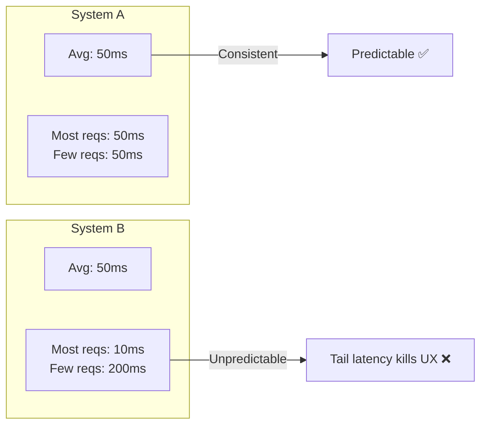

### Percentile Thresholds for Good Systems

| Metric | Acceptable | Good | Excellent |
|--------|-----------|------|-----------|
| **P50** | < 100ms | < 50ms | < 10ms |
| **P95** | < 300ms | < 100ms | < 30ms |
| **P99** | < 1000ms | < 500ms | < 100ms |

---

## 4. Resource Utilization

### CPU/Memory/Disk Utilization Target

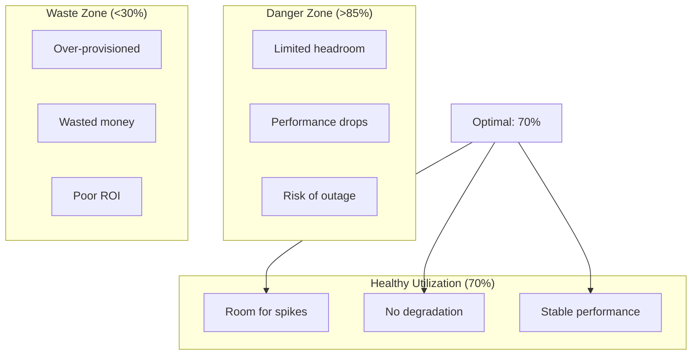

### Why 70% is the Magic Number

```
Utilization Levels:

0% -------|-------|-------|-------|------> 100%
         30%     70%     85%     100%
         
  Waste   ✅Ideal  ⚠️Warning  ❌Critical
         Zone    Zone      Zone
         
- 70%: Balanced cost vs reliability
- Room for traffic spikes (+30%)
- No cascading failures
- Performance stays stable
```

### Capacity Planning Math

```
Target Utilization = 70%
Max Safe Load = Server Capacity × 70%
Headroom = Server Capacity × 30%

Example:
Server can handle: 1000 RPS
Safe load: 1000 × 0.7 = 700 RPS
Headroom for spikes: 300 RPS

If traffic spikes to 900 RPS:
  Current: 700 RPS
  Spike: +200 RPS
  Safe? YES (within headroom)
```

### Multi-Resource Tracking

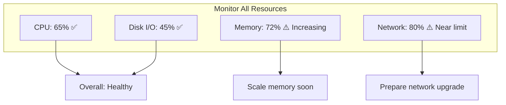

---

## 5. Concurrency & Little's Law

### What is Concurrency?

**Concurrency** = Number of requests being processed **simultaneously** in a system.

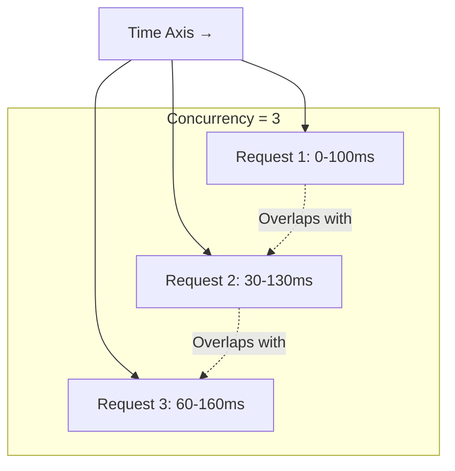

### Little's Law - The Magic Formula

**The most important formula in system design:**

$$L = \lambda \times W$$

Where:
- **L** = Concurrency (number of requests in system)
- **λ** (lambda) = Throughput (requests per second)
- **W** = Average Latency (time per request in seconds)

### Little's Law Intuition

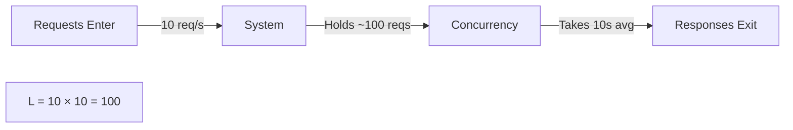

### Little's Law Worked Examples

#### Example 1: Web API

```
Scenario: Checkout service during Black Friday

Given:
  - Throughput: 500 requests/second (λ = 500)
  - Average latency: 200 ms (W = 0.2 seconds)

Calculate Concurrency:
  L = λ × W
  L = 500 × 0.2
  L = 100 concurrent requests

Meaning: About 100 users are checking out simultaneously
```

#### Example 2: Database Connection Pool

```
Given:
  - 1,000 queries per second (λ = 1000)
  - Each query takes 50ms (W = 0.05 seconds)

Connection Pool Size Needed:
  L = 1000 × 0.05
  L = 50 connections

Real-world: Allocate pool size = 50-100 connections
```

#### Example 3: Message Queue

```
Given:
  - 10,000 messages produced per second (λ = 10,000)
  - Average processing time: 1 second (W = 1)

Messages in Queue at Any Time:
  L = 10,000 × 1
  L = 10,000 messages

Infrastructure need: 
  - Queue capacity: ~15,000 to be safe
  - Need fast consumers to prevent overflow
```

### Little's Law Trade-offs Visualization

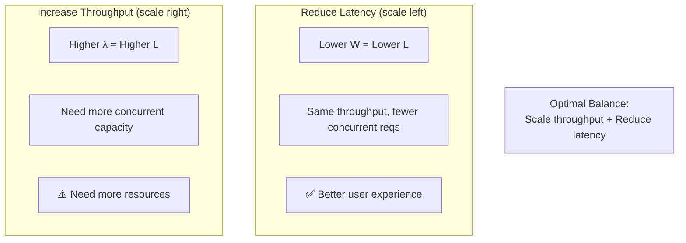

---

## 6. CPU Concepts

### CPU Spinning Problem

**CPU Spinning** = A thread/process continuously checking for work instead of sleeping.

```
❌ BAD - CPU Spinning:
while (!jobReady) {
    // Loop endlessly checking
    // Wastes 100% of one CPU core
    // Burns power, generates heat
}

✅ GOOD - Event-based:
waitForEvent(jobReady) {
    // Sleep until notified
    // CPU is free for other work
    // Power efficient
}
```

### Visual Impact of CPU Spinning

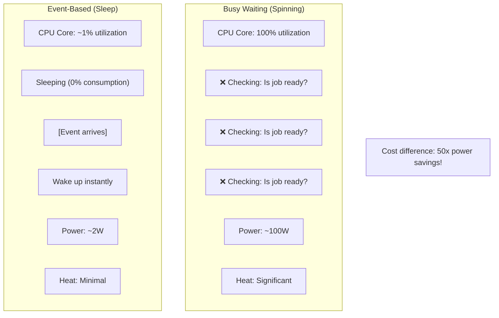

### Real-World Example: Thread Pools

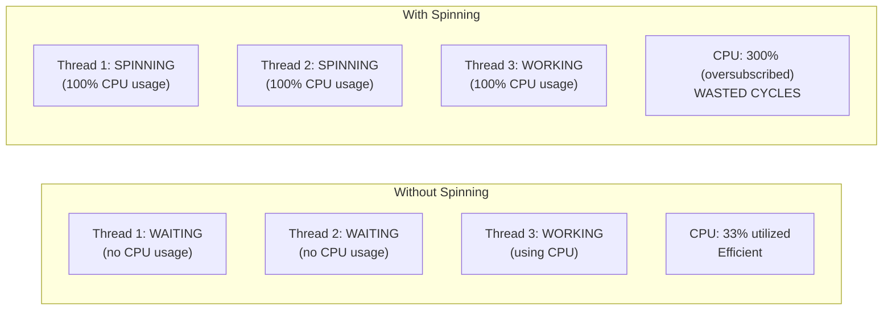

### When to Avoid Spinning

```
❌ Avoid spinning in:
- Event-driven applications
- Microservices
- High-concurrency systems
- Battery-powered devices
- Cloud environments (pay per CPU)

✅ Safe to spin only in:
- Real-time systems (need predictability)
- Lock-free algorithms (rare, specialized)
- Hardware drivers (kernel level)
```

---

## 7. Quick Reference Formulas

### Essential Formulas Chart

| Concept | Formula | When to Use | Example |
|---------|---------|------------|---------|
| **Little's Law** | L = λ × W | Estimate concurrency | 500 RPS × 0.2s = 100 concurrent |
| **Throughput** | λ = N / T | Calculate RPS | 5000 requests / 10s = 500 RPS |
| **Latency** | W = T / N | Average response time | 10s / 5000 = 2ms per request |
| **Capacity** | Cap = Util% × Max | Safe load | 70% × 1000 RPS = 700 safe RPS |
| **Queueing Delay** | D = ρ / (1-ρ) × W | Wait time | ρ=0.8 → 4× latency increase |
| **P99 Rule** | P99 ≈ Average × 5-10 | Estimate tail | 10ms avg → 50-100ms P99 |

### Formula Cheat Sheet

```
┌─────────────────────────────────────────┐
│   CONCURRENCY & CAPACITY PLANNING       │
├─────────────────────────────────────────┤
│ L = λ × W          (Little's Law)       │
│ λ = Throughput (req/sec)                │
│ W = Latency (seconds)                   │
│ L = Concurrency (concurrent requests)   │
│                                         │
│ UTILIZATION                             │
│ U = λ / μ          (μ = capacity)       │
│ Safe U ≈ 70%                            │
│                                         │
│ QUEUE SIZE                              │
│ Q = λ × W - (1-U)  (M/M/1 queue)       │
│                                         │
│ RESPONSE TIME                           │
│ T = W / (1 - U)    (with queuing)       │
└─────────────────────────────────────────┘
```

### Common Values to Remember

```
STORAGE LATENCIES:
- L1 CPU cache:     ~1 nanosecond
- L2 CPU cache:     ~4 nanoseconds
- RAM:              ~100 nanoseconds
- SSD:              ~100 microseconds
- HDD:              ~10 milliseconds
- Network (LAN):    ~1 millisecond
- Network (WAN):    ~100 milliseconds

RULE OF THUMB:
Each 10x further = roughly 100x slower
```

---

## 8. Interview Tips & Patterns

### Common Interview Questions & Answers

#### Q1: "Why not scale everything to 100% utilization?"

```
❌ Wrong Answer:
"Because you want maximum resource usage"

✅ Right Answer:
"At 100% utilization:
1. No room for traffic spikes → system crashes
2. Latency increases exponentially (queueing delays)
3. P99 latency becomes terrible
4. Recovery is impossible
5. 70% is sweet spot: optimal cost-reliability tradeoff"
```

#### Q2: "Should I optimize for latency or throughput?"

```
✅ Right Answer:
"Depends on use case:

USER-FACING (optimize latency):
- Web page loads: target P95 < 200ms
- API calls: target P99 < 100ms
- Real-time: latency critical

BATCH/ASYNC (optimize throughput):
- Log processing: max throughput
- Analytics: can tolerate higher latency
- Backups: throughput matters more"
```

#### Q3: "How many concurrent users can my system handle?"

```
✅ Use Little's Law:
1. Find max throughput (RPS): 1000
2. Find acceptable latency: 100ms = 0.1s
3. L = λ × W = 1000 × 0.1 = 100 concurrent users
4. Remember: this is about requests, not users
   - One user = multiple concurrent requests
   - 100 concurrent requests ≈ 10-20 active users
```

#### Q4: "Why is tail latency (P99) important?"

```
✅ Right Answer:
"P99 matters because:

Example: 1M requests/day
- Average (P50): 50ms - most users OK
- P99 (1% = 10k requests): 500ms - "frozen"

User impact:
- User with 1 request: feels P50 = 50ms ✅
- User with 20 requests: likely hits P99 = 500ms ❌
  Expected: 20 × 50ms = 1s
  Actual: 1+ of them is 500ms → feels slow

This is why P99 matters more than average!"
```

### Interview Problem-Solving Framework

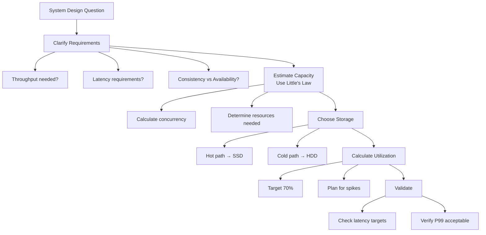

### Key Interview Statements to Drop

```
✅ "We should target 70% utilization for safety"
✅ "Little's Law gives us: L = λ × W"
✅ "P99 latency matters more than average"
✅ "Trade-off: we could increase throughput by batching, 
    but that increases latency"
✅ "We need hot storage (SSD) for this, cold (HDD) for archives"
✅ "At 100% utilization, queueing delays become exponential"
```

---

## 9. Visual Decision Trees

### Storage Technology Decision Tree

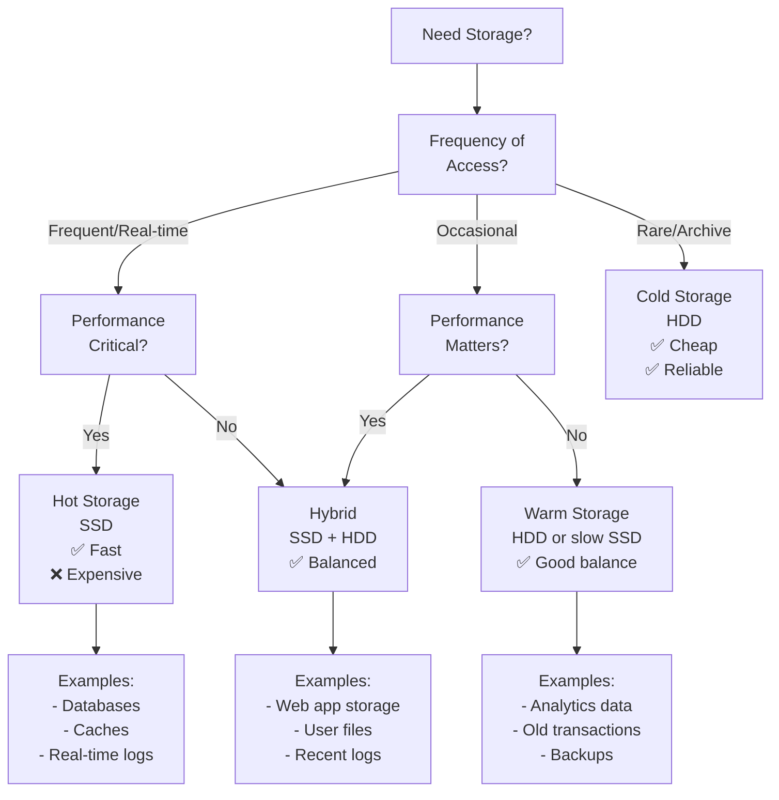

### Performance Optimization Decision Tree

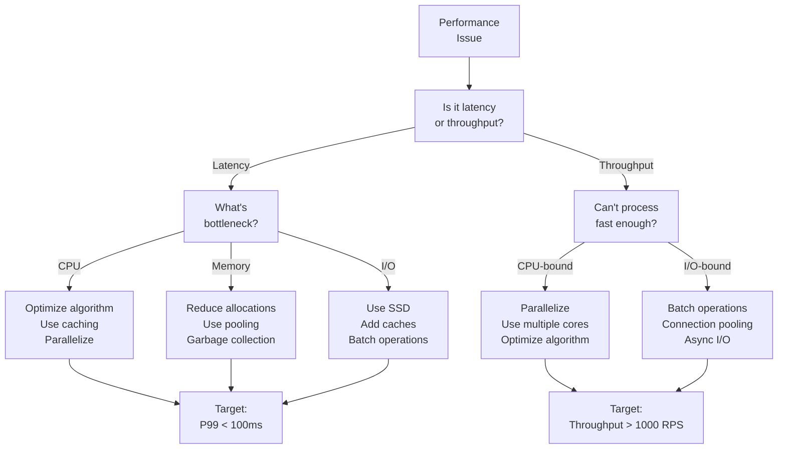

### Capacity Planning Decision Tree

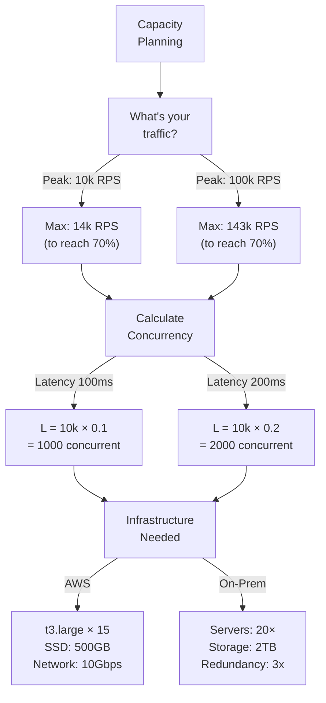

---

## Summary: Core Principles

### The Big Picture

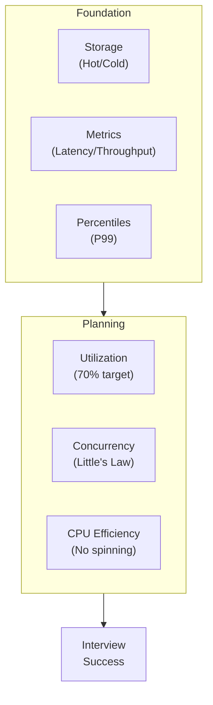

### Three Rules for System Design

```
RULE 1: MEASURE FIRST
└─ Know your latency (all percentiles)
└─ Know your throughput
└─ Use Little's Law to estimate resources

RULE 2: TARGET 70% UTILIZATION
└─ Room for spikes (30% headroom)
└─ Performance stays predictable
└─ Reliability maximized

RULE 3: OPTIMIZE THE BOTTLENECK
└─ Identify where time is spent
└─ Hot path → SSD, optimize latency
└─ Batch path → maximize throughput
└─ Never optimize the wrong metric!
```

### Quick Checklist for System Design

```
□ What's the throughput (RPS)?
  ↳ Use to size infrastructure

□ What's the acceptable latency (P50, P95, P99)?
  ↳ Determine if SSD or HDD needed
  ↳ Check if caching needed

□ Calculate concurrency (L = λ × W)
  ↳ Determine pool sizes, queue sizes

□ Plan for 70% utilization
  ↳ Peak × 1.43 = required capacity

□ Is it a hot path or cold path?
  ↳ Hot → SSD, low latency
  ↳ Cold → HDD, optimize throughput

□ Watch for tail latency (P99)
  ↳ More important than average
  ↳ User experience depends on it
```

---

## Final Reference: Formula Quick Lookup

### All Formulas in One Place

```
LITTLES LAW (Fundamental)
─────────────────────────
L = λ × W
Concurrency = Throughput × Latency

THROUGHPUT & LATENCY
────────────────────
λ (Throughput) = N / T        [Requests per time unit]
W (Latency) = T / N           [Time per request]

UTILIZATION
───────────
ρ = λ / μ                     [λ = arrival rate, μ = service rate]
Safe ρ ≈ 0.7 (70%)
Max Safe λ = 0.7 × μ

QUEUEING (M/M/1 Queue)
──────────────────────
L (queue size) = ρ / (1 - ρ)
W (total time) = 1 / (μ × (1 - ρ))
W_q (wait time) = ρ / (μ × (1 - ρ))

PERCENTILES ESTIMATION
──────────────────────
P95 ≈ P50 × 3-5
P99 ≈ P50 × 10-20
(Varies by system; measure don't estimate!)
```

---

**Last Updated:** 2024 | System Design Interview Preparation
